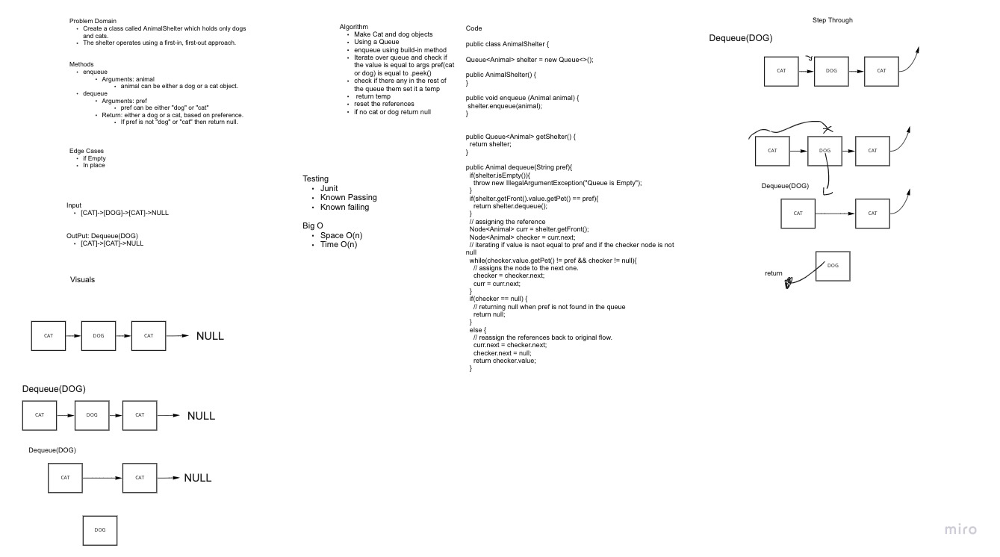

## Challenge
Create a class called AnimalShelter which holds only dogs and cats.
The shelter operates using a first-in, first-out approach.
Implement the following methods:
enqueue
Arguments: animal
animal can be either a dog or a cat object.
dequeue
Arguments: pref
pref can be either "dog" or "cat"
Return: either a dog or a cat, based on preference.
If pref is not "dog" or "cat" then return null.

## WhiteBoard

## Approach & Efficiency
The test were straight forward testing methods.
Stacks and queues have time complexity O(1) and space complexity of  O(n).
## Collaborator
Roger Reyes
