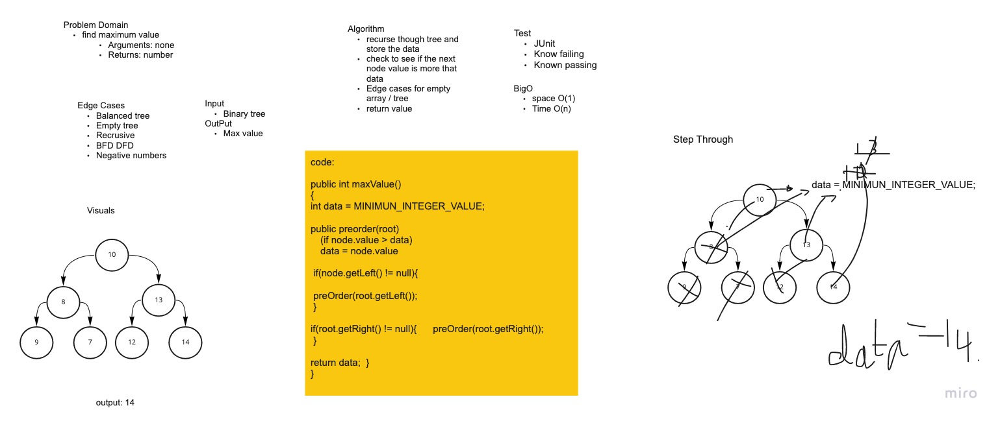

# Challenge Summary
<!-- Description of the challenge -->
Write the following method for the Binary Tree class

find maximum value
Arguments: none
Returns: number
Find the maximum value stored in the tree. You can assume that the values stored in the Binary Tree will be numeric.

## Whiteboard Process
<!-- Embedded whiteboard image -->


## Approach & Efficiency
<!-- What approach did you take? Why? What is the Big O space/time for this approach? -->
Took the recursive approach for each method traversals.

Big O notation: Time Complexity O(n) due to recursion and Auxillary Space complexity O(1).
## Solution
<!-- Show how to run your code, and examples of it in action -->
```java
public int maxValue(){

    maxHelper((Node<Integer>) root);

    return max;
  }


   void maxHelper (Node<Integer> root) {
    if (root == null)
    {
      throw new IllegalArgumentException("Tree is empty");
    }

    if(root.getValue() > max)
    {
      max = root.getValue();
    }
    if(root.getLeft() != null){
      maxHelper(root.getLeft());
    }
    if(root.getRight() != null){
      maxHelper(root.getRight());
    }
  }
```
