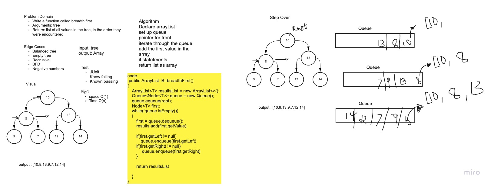

# Challenge Summary
<!-- Description of the challenge -->
Write a function called breadth first
Arguments: tree
Return: list of all values in the tree, in the order they were encountered
NOTE: Traverse the input tree using a Breadth-first approach

## Whiteboard Process
<!-- Embedded whiteboard image -->


## Approach & Efficiency
<!-- What approach did you take? Why? What is the Big O space/time for this approach? -->

Took the recursive approach for each method traversals.

Big O notation: Time Complexity O(n) due to recursion and Auxillary Space complexity O(1).

## Solution
<!-- Show how to run your code, and examples of it in action -->

```java
public ArrayList<T> breadthFirst() {
    ArrayList<T> results = new ArrayList<>();
    Queue<Node<T>> queue = new Queue();
    queue.enqueue(root);
    Node<T> first;
    while (!queue.isEmpty()) {
      first = queue.dequeue();
      results.add(first.getValue());

      if (first.getLeft() != null)
        queue.enqueue(first.getLeft());
      if (first.getRight() != null)
        queue.enqueue(first.getRight());
    }

    return results;

  }
```
