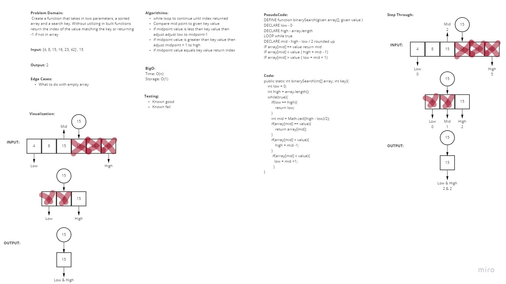

##  Binary Search

## Colobarated with: Roger Reyes

## Problem Domain

Write a function called BinarySearch which takes in 2 parameters: a sorted array and the search key. Without utilizing any of the built-in methods available to your language, return the index of the array’s element that is equal to the value of the search key, or -1 if the element is not in the array.

## Approach & Efficiency

In my approach I decided to set values for the first index and the last index in the given array. These values helped to alter the midpoint which was what I was comparing the key to. If the key was greater than the midpoint value then the low point was moved up to cut out the entire left side of the array and vice versa if the key was less than the midpoint. If the array value equalled the key or if the lowpoint matched the highpoint I returned the index of the array value.

## BigO

space was O(1) since we did it in place

Time was O(n) since we used a loop.

