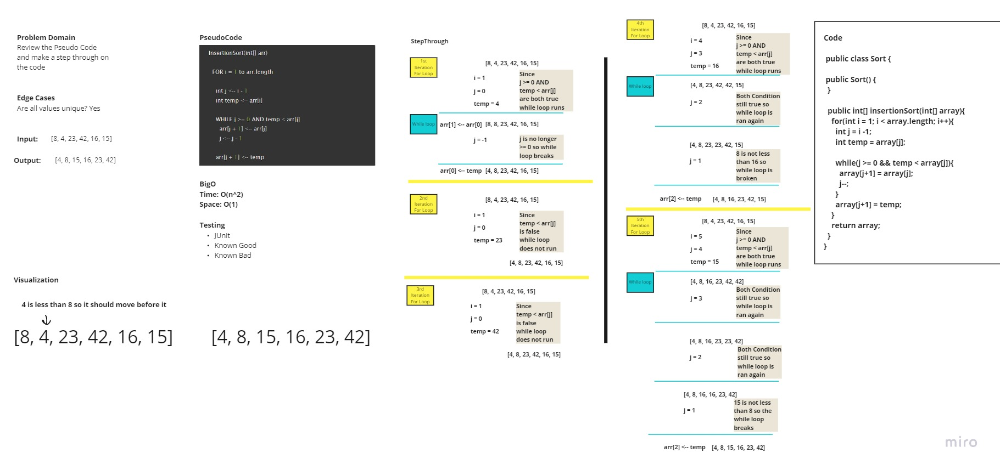

# Hash Table

## Challenge 32

### White Board Process
Review the pseudocode below, then trace the algorithm by stepping through the process with the provided sample array. Document your explanation by creating a blog article that shows the step-by-step output after each iteration through some sort of visual.
## Contributors
- Roger reyes
- Mike

## WhiteBoard

## Approach & Efficiency

- The time complexity of the sort is O(n^2)
- The space complexity is O(1)

# API

#### Work Time: 2 Hour
