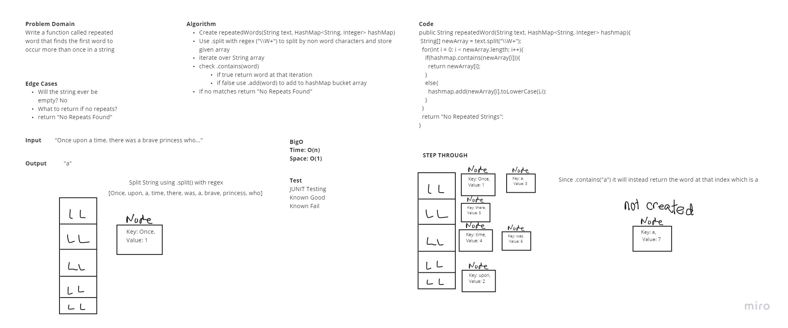

# Hash Table

## Challenge 31

### White Board Process
Write a function called repeated word that finds the first word to occur more than once in a string
- Arguments: string
- Return: string
## Contributors
- Roger reyes
- Michael Brunette

## WhiteBoard

## Approach & Efficiency

- The time complexity of hash table is O(n)
- The space complexity is O(n)

# API

- repeatWords(String str)

#### Work Time: 3 Hour
