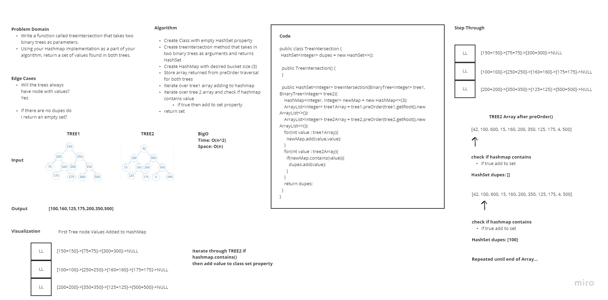

# Hash Table

## Challenge 32

### White Board Process
Write a function called tree_intersection that takes two binary trees as parameters.
Using your Hashmap implementation as a part of your algorithm, return a set of values found in both trees.
## Contributors
- Roger reyes

## WhiteBoard

## Approach & Efficiency

- The time complexity of hash table is O(n^2)
- The space complexity is O(n)

# API

- tree_intersection(BinaryTree tree1,BinaryTree tree2)

#### Work Time: 3 Hour
